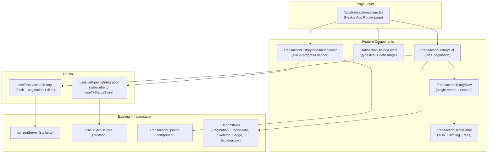
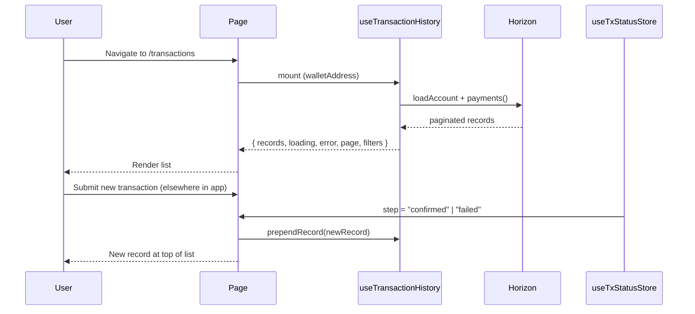

# Design Document: Transaction History View

## Overview

The Transaction History View adds a dedicated, paginated page at `/transactions` that lets connected wallet users browse, filter, and inspect every on-chain transaction associated with their Stellar address. It surfaces the full Soroban transaction lifecycle — escrow deposits, milestone releases, bid submissions, and dispute resolutions — in a developer-friendly yet accessible UI.

The feature is built entirely on top of existing infrastructure:

- **Data layer**: Horizon REST API (`horizonServer` from `stellar.ts`) for historical records; Soroban RPC for live pipeline state.
- **Live integration**: `useTxStatusStore` (Zustand) for real-time pipeline step updates.
- **UI primitives**: Existing `Pagination`, `EmptyState`, `Skeleton`, `ExplorerLink`, `Badge` components from `components/ui/`.
- **Pipeline display**: Existing `TransactionPipeline` component for the in-progress indicator.

No new backend services are required. All data is fetched client-side from Horizon and the Soroban RPC, consistent with the rest of the application.

---

## Architecture



### Data Flow



---

## Components and Interfaces

### Page: `/app/transactions/page.tsx`

A Next.js App Router client component that composes the feature components. Reads wallet address from `useWallet()` and passes it to `useTransactionHistory`.

```tsx
"use client";
export default function TransactionsPage() { ... }
```

### `useTransactionHistory` hook

Central data hook. Responsibilities:
- Fetch transaction records from Horizon for the connected wallet address.
- Manage pagination state (current page, page size, total pages).
- Apply client-side filters (operation type, date range).
- Expose `prependRecord` for live pipeline integration.
- Handle loading, error, and empty states.

```ts
interface UseTransactionHistoryReturn {
  records: TransactionRecord[];          // filtered + paginated slice
  allRecords: TransactionRecord[];       // full unfiltered list
  loading: boolean;
  error: string | null;
  page: number;
  totalPages: number;
  pageSize: number;
  filters: TransactionFilters;
  setPage: (page: number) => void;
  setPageSize: (size: number) => void;
  setFilters: (filters: Partial<TransactionFilters>) => void;
  clearFilters: () => void;
  retry: () => void;
  prependRecord: (record: TransactionRecord) => void;
}
```

### `useLivePipelineIntegration` hook

Subscribes to `useTxStatusStore`. When the store transitions to `"confirmed"` or `"failed"`, constructs a `TransactionRecord` from the store state and calls `prependRecord` on the history hook.

```ts
function useLivePipelineIntegration(
  prependRecord: (record: TransactionRecord) => void
): void
```

### `TransactionHistoryList`

Renders the list of `TransactionHistoryRow` components, the `Pagination` control, and delegates empty/loading states to `EmptyState` and `Skeleton` primitives.

Props:
```ts
interface TransactionHistoryListProps {
  records: TransactionRecord[];
  loading: boolean;
  error: string | null;
  page: number;
  totalPages: number;
  pageSize: number;
  onPageChange: (page: number) => void;
  onPageSizeChange: (size: number) => void;
  onRetry: () => void;
}
```

### `TransactionHistoryFilters`

Renders the operation-type multi-select and date-range picker. Calls `setFilters` on change. Renders a "Clear filters" button when any filter is active.

Props:
```ts
interface TransactionHistoryFiltersProps {
  filters: TransactionFilters;
  onChange: (filters: Partial<TransactionFilters>) => void;
  onClear: () => void;
}
```

### `TransactionHistoryRow`

Renders a single `TransactionRecord` as a table/list row. Includes:
- Truncated monospace hash with copy button and `ExplorerLink`.
- Operation type label badge.
- Status badge (green for confirmed, red for failed).
- Fee in XLM (7 decimal places) with stroops secondary label.
- Relative timestamp.
- Expand/collapse toggle for `TransactionDetailPanel`.

Props:
```ts
interface TransactionHistoryRowProps {
  record: TransactionRecord;
  isExpanded: boolean;
  onToggleExpand: () => void;
}
```

### `TransactionDetailPanel`

Rendered inside an expanded `TransactionHistoryRow`. Shows:
- Full transaction hash (copyable).
- Simulated fee vs. actual on-chain fee comparison.
- `SimulationLog` metrics (CPU, memory, ledger I/O).
- In Dev_Mode: collapsible unsigned XDR, signed XDR, and raw simulation JSON panels.

Props:
```ts
interface TransactionDetailPanelProps {
  record: TransactionRecord;
  isDev: boolean;
}
```

### `TransactionHistoryPipelineIndicator`

Renders at the top of the history list when `useTxStatusStore.step` is a non-idle, non-terminal step. Wraps the existing `TransactionPipeline` component with `role="status"` and `aria-live="polite"`.

---

## Data Models

### `TransactionRecord`

The canonical in-memory representation of a single transaction entry.

```ts
export type OperationType =
  | "escrow_deposit"
  | "milestone_release"
  | "bid_submit"
  | "dispute_open"
  | "other";

export type TransactionStatus = "confirmed" | "failed";

export interface SimulationMetrics {
  estimatedFeeStroops: string;   // from SimulationLog.estimatedTotalFee
  cpuInstructions: string;
  memoryBytes: string;
  readBytes: number;
  writeBytes: number;
  baseFeeStroops: string;
  resourceFeeStroops: string;
}

export interface TransactionRecord {
  /** Stellar transaction hash (64-char hex) */
  txHash: string;
  /** Detected operation type */
  operationType: OperationType;
  /** Terminal status */
  status: TransactionStatus;
  /** Actual fee charged on-chain, in stroops (from Horizon response) */
  feeChargedStroops: string;
  /** ISO 8601 timestamp from Horizon */
  createdAt: string;
  /** Failure reason, if status === "failed" */
  failureReason?: string;
  /** Simulation diagnostics, if available */
  simulationMetrics?: SimulationMetrics;
  /** Unsigned XDR — only populated in Dev_Mode */
  unsignedXdr?: string;
  /** Signed XDR — only populated in Dev_Mode */
  signedXdr?: string;
}
```

### `TransactionFilters`

```ts
export interface TransactionFilters {
  operationTypes: OperationType[];   // empty = show all
  dateFrom: Date | null;
  dateTo: Date | null;
}

export const DEFAULT_FILTERS: TransactionFilters = {
  operationTypes: [],
  dateFrom: null,
  dateTo: null,
};
```

### Horizon Response Mapping

Horizon's `payments` endpoint returns `ServerApi.PaymentOperationRecord` objects. The mapping function `mapHorizonRecordToTransactionRecord` converts these to `TransactionRecord`:

- `txHash` ← `record.transaction_hash`
- `operationType` ← inferred from `record.type` and memo/operation fields
- `status` ← `record.transaction_successful ? "confirmed" : "failed"`
- `feeChargedStroops` ← `record.transaction?.fee_charged ?? "0"`
- `createdAt` ← `record.created_at`

### Fee Formatting

```ts
// Converts stroops to XLM with 7 decimal places
export function formatFeeXlm(stroops: string): string {
  const n = Number(stroops);
  return `${(n / 10_000_000).toFixed(7)} XLM`;
}

// Applies the 2% safety margin (FEE_MARGIN_BPS = 200)
export function applyFeeMargin(simulatedFeeStroops: string): string {
  const base = BigInt(simulatedFeeStroops);
  const margin = (base * 200n) / 10_000n;
  return (base + margin).toString();
}
```

---

## Correctness Properties

*A property is a characteristic or behavior that should hold true across all valid executions of a system — essentially, a formal statement about what the system should do. Properties serve as the bridge between human-readable specifications and machine-verifiable correctness guarantees.*

This feature contains pure transformation and filtering functions that are well-suited to property-based testing. The property-based testing library used is **fast-check** (already compatible with the Vitest setup in `package.json`).

### Property 1: Pagination slice correctness

*For any* list of `TransactionRecord` objects, page number, and page size, the paginated slice should contain exactly `min(pageSize, remaining)` records starting at the correct offset, and every record in the slice should also appear in the original list.

**Validates: Requirements 1.2**

### Property 2: Transaction record rendering completeness

*For any* `TransactionRecord`, the rendered `TransactionHistoryRow` output should contain the transaction hash, the operation type label, a status badge, the fee formatted in XLM, and a relative timestamp.

**Validates: Requirements 2.1**

### Property 3: Explorer link presence for confirmed records

*For any* `TransactionRecord` with `status === "confirmed"`, the rendered row should contain an anchor element whose `href` includes the transaction hash and points to `stellar.expert`.

**Validates: Requirements 2.2**

### Property 4: Failed record badge styling

*For any* `TransactionRecord` with `status === "failed"` and a non-empty `failureReason`, the rendered row should display a badge with red styling and the failure reason text.

**Validates: Requirements 2.4**

### Property 5: Date-range filter correctness

*For any* list of `TransactionRecord` objects and any date range `[dateFrom, dateTo]`, the filtered result should contain only records whose `createdAt` timestamp falls within `[dateFrom, dateTo]` (inclusive), and no records outside that range.

**Validates: Requirements 4.2**

### Property 6: Filter clear is a round-trip

*For any* list of `TransactionRecord` objects and any `TransactionFilters` state, applying filters and then clearing all filters should produce a result equal to the original unfiltered list.

**Validates: Requirements 4.4**

### Property 7: Live confirmed record is prepended

*For any* existing history list and any newly confirmed `TransactionRecord` from the pipeline store, after prepending, the first element of the list should be the new record and the rest of the list should be unchanged.

**Validates: Requirements 5.1, 5.2**

### Property 8: In-progress step label display

*For any* non-idle, non-terminal `TxLifecycleStep` value, the `TransactionHistoryPipelineIndicator` should render a visible label that corresponds to that step.

**Validates: Requirements 5.3**

### Property 9: Fee margin calculation

*For any* simulated fee value (as a non-negative integer string), `applyFeeMargin(fee)` should return a value equal to `fee + floor(fee * 200 / 10000)`, and the result should always be greater than or equal to the input.

**Validates: Requirements 7.2**

### Property 10: Fee formatting precision

*For any* stroop value (non-negative integer), `formatFeeXlm(stroops)` should produce a string that ends with " XLM", contains exactly 7 digits after the decimal point, and whose numeric value equals `stroops / 10_000_000`.

**Validates: Requirements 7.4**

### Property 11: Simulation log rendering completeness

*For any* `SimulationMetrics` object, the rendered `TransactionDetailPanel` should contain all six required fields: estimated total fee, CPU instruction count, memory byte count, ledger read bytes, ledger write bytes, and base fee.

**Validates: Requirements 7.1**

### Property 12: Icon-only controls have aria-labels

*For any* rendered state of `TransactionHistoryRow` or `TransactionDetailPanel`, every button element that contains only an icon (no visible text) should have a non-empty `aria-label` attribute that describes the action and references the associated transaction hash.

**Validates: Requirements 9.2**

---

## Error Handling

| Scenario | Handling |
|---|---|
| Horizon fetch fails | `useTransactionHistory` sets `error` string; page renders `role="alert"` banner with failure reason and retry button |
| No wallet connected | Page renders `EmptyState` with "Connect your wallet" prompt |
| No records match filters | `TransactionHistoryList` renders `EmptyState` with "No results match your filters" |
| Wallet signing rejected | `useTxStatusStore` transitions to `"failed"` with message "Signing cancelled by wallet"; `useLivePipelineIntegration` prepends a failed record |
| Sequence number mismatch (≤3 retries) | Pipeline retries automatically; `TransactionHistoryPipelineIndicator` shows "Sequence mismatch — retrying (n/3)" |
| Sequence number mismatch (>3 retries) | Pipeline emits `"failed"` with message including "sequence number mismatch after 3 attempts"; failed record prepended to history |
| Confirmation timeout | Pipeline emits `"failed"` with timeout message; failed record prepended |
| Clipboard API unavailable | Copy button catches the error silently; no "Copied!" confirmation is shown |

---

## Testing Strategy

### Unit Tests (example-based)

Focused on specific behaviors and edge cases:

- `useTransactionHistory`: fetch called with wallet address on mount; error state on Horizon failure; loading state during fetch; empty state when no wallet.
- `TransactionHistoryRow`: expand/collapse toggle; copy button writes to clipboard and shows "Copied!"; XDR panels hidden in production mode.
- `TransactionDetailPanel`: shows both simulated and actual fees when expanded; raw JSON panel only in Dev_Mode.
- `TransactionHistoryFilters`: filter change updates list; clear button restores full list.
- `useLivePipelineIntegration`: confirmed store state triggers prepend; failed store state triggers prepend with failure reason.
- Pipeline logging: `console.debug` called with correct labels in dev mode; suppressed in production.
- Accessibility: `role="status"` and `aria-live="polite"` on pipeline indicator; `aria-label` on icon-only controls.

### Property-Based Tests (fast-check)

Each property from the Correctness Properties section is implemented as a single property-based test with a minimum of 100 iterations. Tests are tagged with the feature and property number.

```ts
// Example tag format:
// Feature: transaction-history-view, Property 1: Pagination slice correctness
it.prop([fc.array(arbitraryTransactionRecord()), fc.integer({ min: 1 }), fc.integer({ min: 1, max: 50 })])(
  "Feature: transaction-history-view, Property 1: Pagination slice correctness",
  ([records, page, pageSize]) => { ... }
);
```

Properties 1, 5, 6, 7, 9, and 10 are pure function tests (no DOM rendering required) and run fastest. Properties 2, 3, 4, 8, 11, and 12 use `@testing-library/react` to render components with generated props.

### Integration Tests

- Horizon fetch with a real (testnet) wallet address returns a valid paginated response.
- `ExplorerLink` renders the correct URL for testnet vs. mainnet based on `NEXT_PUBLIC_STELLAR_NETWORK`.

### Test File Locations

```
apps/web/components/transaction/__tests__/
  transaction-history-row.test.tsx
  transaction-detail-panel.test.tsx
  transaction-history-filters.test.tsx
  transaction-history-pipeline-indicator.test.tsx

apps/web/hooks/__tests__/
  use-transaction-history.test.ts
  use-live-pipeline-integration.test.ts

apps/web/lib/__tests__/
  transaction-history-utils.test.ts   (formatFeeXlm, applyFeeMargin, mapHorizonRecord, paginateRecords, filterRecords)
```
